

  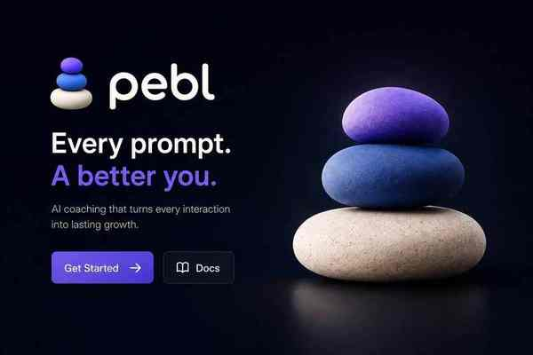

  <strong>AI Collaboration Intelligence for people working with AI agents.</strong>

  Pebl observes how you work with AI, turns meaningful tasks into evidence-backed feedback,
  and helps every next interaction become better.

  <a href="docs/01-product/canonical-prd.md"><strong>Read the PRD</strong></a>
  ·
  <a href="docs/README.md"><strong>Explore the docs</strong></a>
  ·
  <a href="https://github.com/lukaas-jopcik/pebl/issues"><strong>View the roadmap</strong></a>

  
  
  
  

---

## AI gets feedback. You should too.

AI tools measure their own performance. People rarely get equally useful feedback on how they collaborate with them.

Pebl answers the questions that current AI tooling usually misses:

- Why did this task need multiple corrections?
- Which context was rediscovered?
- What work was avoidable?
- Was the result actually verified?
- What should change next time?
- Is collaboration quality improving?

> **Every AI interaction should improve either the current result or the next interaction.**

  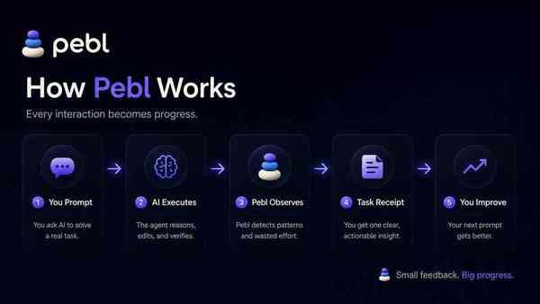

No manual task creation. No forced workflow. No generic prompt-engineering lecture.

Pebl stays quiet until it has something useful to say.

---

## What Pebl gives you

  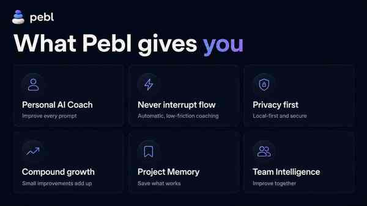

The initial wedge is an **open-source, terminal-first AI Coach** for AI-native developers.

---

## AI Task Receipts

Every meaningful AI task becomes a compact retrospective:

- intent and outcome;
- time, tokens, tools, and files where available;
- verification evidence;
- retries and repeated discovery;
- one high-confidence improvement;
- a reusable project learning.

  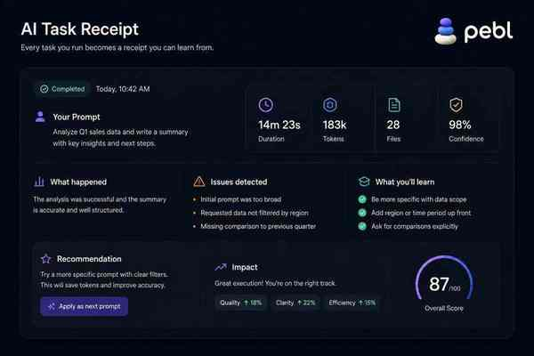

The default experience surfaces one precise recommendation rather than a wall of generic advice.

---

## Daily AI Performance Report

Pebl helps the user answer one practical question:

> **Did I collaborate with AI better today?**

  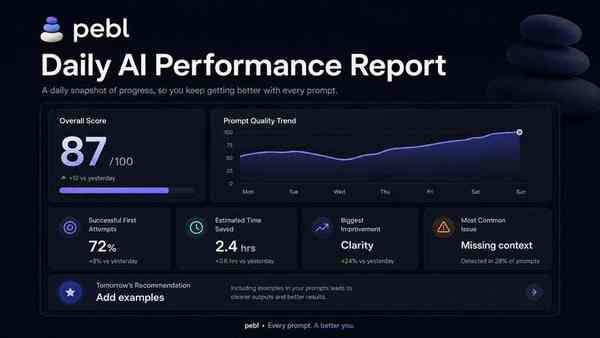

The report focuses on first-pass success, verification, clarity, avoidable effort, habits, and one recommendation for tomorrow.

---

## AI Work Graph

Pebl connects tasks, projects, prompts, receipts, habits, memories, and improvements into a longitudinal Human × AI performance graph.

  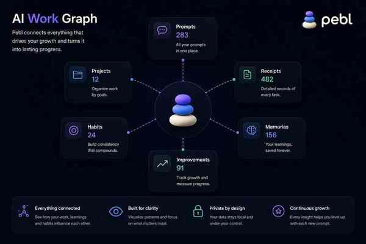

Providers know what their model did. Pebl learns how the person, model, and project work together over time.

---

## Project Memory

Useful interaction-level learnings become reusable project intelligence.

  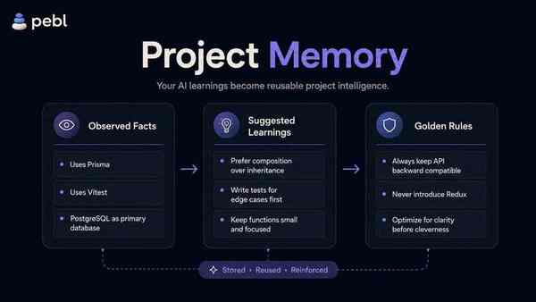

Project Memory has three confidence layers:

1. **Observed Facts** — detected automatically.
2. **Suggested Learnings** — proposed for review.
3. **Golden Rules** — explicitly approved and reusable.

---

## Privacy-first by design

Pebl is built to earn the trust of developers and security teams.

  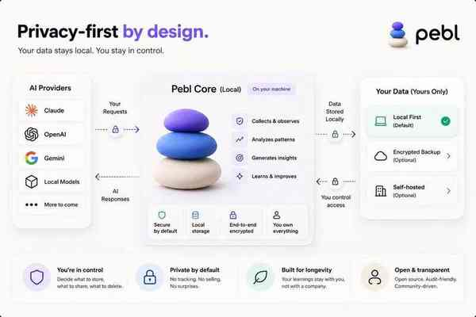

### Local Only
Collection, redaction, history, and baseline analysis remain on the device.

### Hybrid
Only user-approved metadata is synchronized for managed analysis and cross-device history.

### Enterprise
Configurable retention, data residency, private endpoints, and future self-hosted deployment.

**Source code and full prompts are not uploaded by default.**

---

## Bring Your Own Intelligence

Pebl is provider-independent.

  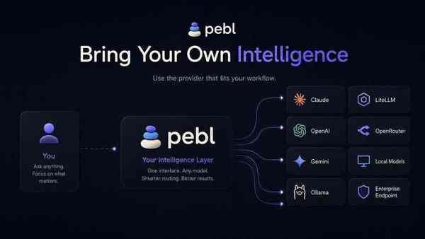

Planned analysis options include:

- Pebl managed cloud;
- Anthropic;
- OpenAI;
- Gemini;
- OpenRouter;
- LiteLLM;
- Ollama and local models;
- enterprise OpenAI-compatible endpoints.

Consumer subscriptions are supported only when the provider exposes an authorized and documented integration path.

---

## Roadmap

  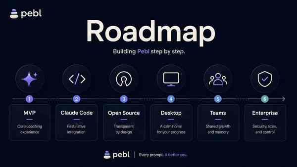

| Stage | Focus |
|---|---|
| **MVP** | Claude Code integration, local event collector, receipts, daily report |
| **Personal** | Behavior Memory, AI Work Graph, managed analysis |
| **Project** | Project Memory, reusable rules, multi-provider support |
| **Teams** | Shared intelligence, project playbooks, policies |
| **Enterprise** | SSO, audit, data residency, private deployment |

Follow active implementation work in [GitHub Issues](https://github.com/lukaas-jopcik/pebl/issues).

---

## Pebl Bible

This repository is the canonical source of truth for the company and product.

| Area | Documents |
|---|---|
| **Foundation** | [Manifesto](docs/00-foundation/manifesto.md) · [Vision](docs/00-foundation/vision-strategy.md) · [Principles](docs/00-foundation/product-principles.md) |
| **Product** | [Canonical PRD](docs/01-product/canonical-prd.md) · [Task Receipt](docs/01-product/ai-task-receipt.md) · [Daily Report](docs/01-product/daily-report.md) |
| **Engineering** | [System Architecture](docs/02-engineering/system-architecture.md) · [Event Model](docs/02-engineering/event-model.md) · [Data Model](docs/02-engineering/data-model.md) · [Providers](docs/02-engineering/provider-architecture.md) |
| **AI** | [Coach Engine](docs/03-ai/coach-engine.md) · [Prompt Quality](docs/03-ai/prompt-quality-engine.md) |
| **Trust** | [Privacy & Security](docs/04-security/privacy-security.md) · [Security Policy](SECURITY.md) |
| **Business** | [Open Source Strategy](docs/05-business/open-source-strategy.md) · [Pricing & GTM](docs/05-business/pricing-gtm.md) |
| **Execution** | [Roadmap](docs/06-roadmap/roadmap.md) · [Validation Plan](docs/06-roadmap/validation-plan.md) · [ADRs](docs/07-decisions/) |

---

## Contributing

Pebl is open-source first because the collection and privacy boundary must be inspectable.

Early contribution areas include AI CLI adapters, local event collection, prompt classification, redaction, receipt evaluation, provider integrations, and terminal UX.

Read [CONTRIBUTING.md](CONTRIBUTING.md) before opening a pull request.

  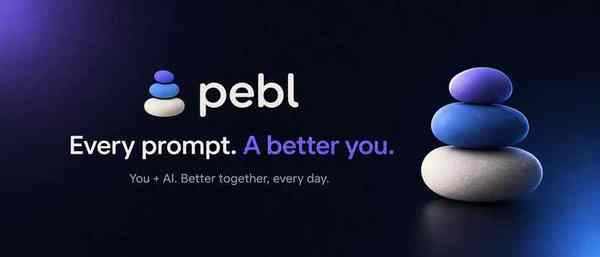

