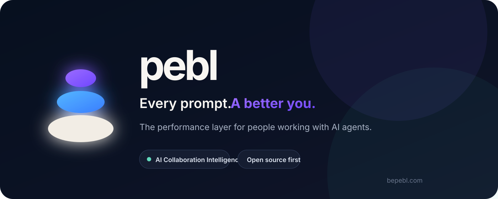
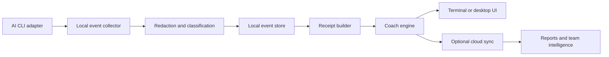

<p align="center">
  
</p>

<p align="center">
  <strong>The performance layer for people working with AI agents.</strong>
</p>

<p align="center">
  Pebl observes Human × AI collaboration, finds avoidable effort, and turns every meaningful interaction into a better next one.
</p>

<p align="center">
  <a href="docs/01-product/canonical-prd.md"><strong>Read the PRD</strong></a>
  ·
  <a href="docs/README.md"><strong>Explore the docs</strong></a>
  ·
  <a href="https://github.com/lukaas-jopcik/pebl/issues"><strong>View the roadmap</strong></a>
</p>

<p align="center">
  
  
  
  
</p>

---

## AI gets feedback. You should too.

AI tools can show token usage, cost, latency, and model performance. They rarely tell the person behind the prompt:

- why the agent needed three corrections;
- which context was discovered repeatedly;
- what caused avoidable work;
- whether the result was actually verified;
- what should change the next time;
- whether collaboration quality is improving over time.

**Pebl closes that feedback loop.**

It does not try to replace Claude Code, Codex, Gemini CLI, Cursor, or the next AI workspace. Pebl sits across them as a neutral intelligence layer for the human operator.

> **Product law:** Every AI interaction should improve either the current result or the next interaction.

---

## The Pebl loop

```text
Your prompt
    ↓
AI agent works
    ↓
Pebl observes the path
    ↓
One evidence-backed insight
    ↓
Project and behavior memory improve
    ↓
Your next prompt gets better
```

No manual task creation. No forced workflow. No generic prompt-engineering lecture.

Pebl stays quiet until it has something useful to say.

---

## The first product

The initial Pebl module is an **open-source, terminal-first AI Coach** for AI-native developers.

<table>
<tr>
<td width="50%" valign="top">

### AI Task Receipt

After meaningful AI work, Pebl summarizes:

- the intended outcome;
- what was actually delivered;
- time, tools, retries, and available usage data;
- repeated discovery or abandoned paths;
- verification evidence;
- one high-confidence improvement.

</td>
<td width="50%" valign="top">

### Daily Performance Report

At the end of the day, Pebl shows:

- meaningful AI interactions;
- first-pass and verification trends;
- estimated avoidable effort;
- habits that are becoming stronger;
- recurring collaboration issues;
- one recommendation for tomorrow.

</td>
</tr>
</table>

### Example receipt

```text
TASK COMPLETED
Implement Google OAuth

Outcome
✓ Build passed
✓ 18 tests passed

Effort
12m 48s · 184k tokens · 21 tool calls

Main inefficiency
The session strategy was not specified. The agent first
implemented JWT sessions, then replaced them after discovering
the existing Prisma adapter.

Recommended improvement
Include the existing authentication adapter and session strategy
in the initial prompt.

Confidence
High — supported by two abandoned paths and repeated config reads.
```

---

## Built for juniors, seniors, and teams

| User | Pebl value |
|---|---|
| **Junior developer** | Learns how to scope, constrain, and verify AI-assisted work. |
| **Senior engineer** | Detects architecture drift, repeated discovery, weak verification, and avoidable complexity. |
| **Technical founder** | Understands where AI time and tokens go, and which workflows produce reliable results. |
| **Engineering team** | Turns individual agent sessions into reusable project intelligence and shared conventions. |
| **Enterprise** | Gains governed, privacy-aware Human × AI collaboration intelligence without default source-code upload. |

---

## Privacy is part of the architecture

Pebl is designed to earn the trust of developers and security teams.

### Local Only

Collection, redaction, history, and baseline analysis remain on the device. No account is required.

### Hybrid

Only user-approved metadata is synchronized for managed analysis, long-term progress, and cross-device reporting.

### Enterprise

Configurable retention, data residency, private endpoints, customer-managed controls, and future self-hosted deployment.

**Source code and full prompts are not uploaded by default.** The collection layer is open source so users can inspect what leaves their machine.

---

## Provider-independent by design

Pebl follows a **Bring Your Own Intelligence** model.

Planned analysis options include:

- Pebl managed cloud;
- Anthropic API;
- OpenAI API;
- Gemini API;
- OpenRouter;
- LiteLLM;
- Ollama and LM Studio;
- enterprise OpenAI-compatible endpoints.

Consumer subscriptions are supported only when providers expose an authorized and documented integration path. Pebl will not bypass provider billing or imitate private user sessions.

---

## Product architecture



The first implementation target is **Claude Code**, followed by **Codex CLI** and **Gemini CLI**.

---

## Roadmap

<table>
<tr>
<td width="25%" valign="top">

### 01 — Validate

- Claude Code integration research
- automatic interaction detection
- 100 manually reviewed receipts
- usefulness and interruption testing

</td>
<td width="25%" valign="top">

### 02 — Personal

- local collector
- AI Task Receipts
- daily reports
- Behavior Memory
- AI Work Graph

</td>
<td width="25%" valign="top">

### 03 — Project

- Project Memory
- reusable rules
- shared conventions
- multi-provider support

</td>
<td width="25%" valign="top">

### 04 — Teams

- Team Intelligence
- enterprise policies
- private deployment
- ecosystem and plugins

</td>
</tr>
</table>

Follow the implementation work in [GitHub Issues](https://github.com/lukaas-jopcik/pebl/issues).

---

## Pebl Bible

The repository is the canonical source of truth for the company and product.

| Area | Documents |
|---|---|
| **Foundation** | [Manifesto](docs/00-foundation/manifesto.md) · [Vision](docs/00-foundation/vision-strategy.md) · [Principles](docs/00-foundation/product-principles.md) |
| **Product** | [Canonical PRD](docs/01-product/canonical-prd.md) · [Task Receipt](docs/01-product/ai-task-receipt.md) · [Daily Report](docs/01-product/daily-report.md) |
| **Engineering** | [System Architecture](docs/02-engineering/system-architecture.md) · [Event Model](docs/02-engineering/event-model.md) · [Data Model](docs/02-engineering/data-model.md) · [Providers](docs/02-engineering/provider-architecture.md) |
| **AI** | [Coach Engine](docs/03-ai/coach-engine.md) · [Prompt Quality](docs/03-ai/prompt-quality-engine.md) |
| **Trust** | [Privacy & Security](docs/04-security/privacy-security.md) · [Security Policy](SECURITY.md) |
| **Business** | [Open Source Strategy](docs/05-business/open-source-strategy.md) · [Pricing & GTM](docs/05-business/pricing-gtm.md) |
| **Execution** | [Roadmap](docs/06-roadmap/roadmap.md) · [Validation Plan](docs/06-roadmap/validation-plan.md) · [ADRs](docs/07-decisions/) |

---

## Contributing

Pebl is open-source first because the collection and privacy boundary must be inspectable.

Early contribution areas:

- AI CLI adapters;
- local event collection;
- prompt classification;
- terminal UX;
- redaction and anonymization;
- receipt evaluation;
- provider integrations.

Read [CONTRIBUTING.md](CONTRIBUTING.md) before opening a pull request.

---

<p align="center">
  <strong>Every prompt. A better you.</strong>
  <br />
  <sub>Pebl · AI Collaboration Intelligence · bepebl.com</sub>
</p>
