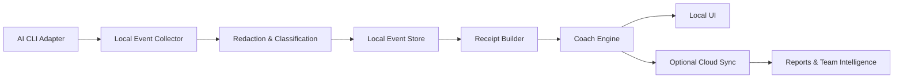

# System Architecture

## Components

### Local Collector
Captures supported terminal and agent events.

### Local Analyzer
Performs deterministic classification, redaction, prompt importance scoring, and basic metrics.

### Coach Engine
Combines deterministic evidence with optional model-based interpretation.

### Memory Engine
Stores observed facts, suggested learnings, and approved rules.

### Sync Client
Synchronizes allowed metadata and encrypted user data.

### Cloud API
Provides authentication, cross-device history, managed inference, reporting, and team features.

### Desktop/Web Companion
Displays timeline, receipts, reports, Work Graph, memory, and settings.

## Data flow

## Local-first rule

Raw code and full transcripts are not required for baseline functionality.

## Failure behavior

Pebl must fail open: if Pebl crashes or becomes unavailable, the user's AI workflow continues unaffected.
